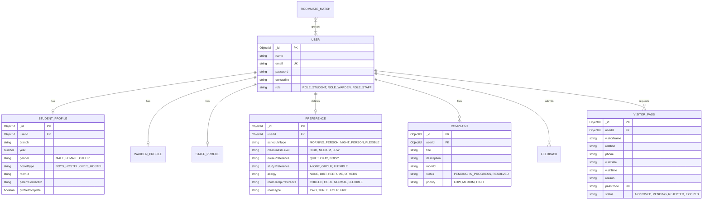
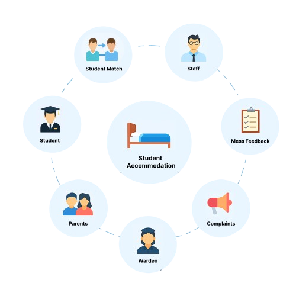
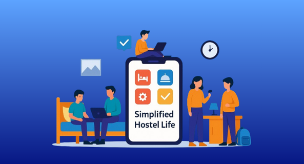
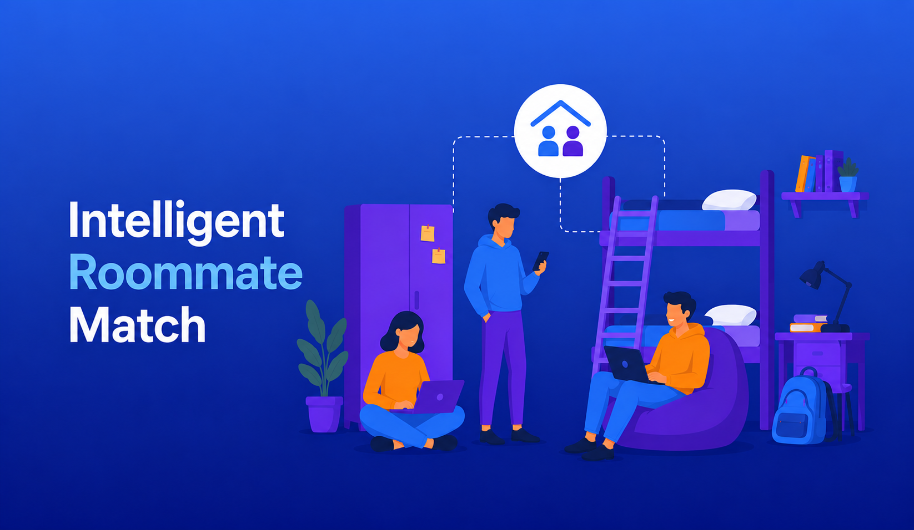

<div align="center">

  <h1>🏰 UniNest — Smart Hostel & Student Management System</h1>
  <p><b>A modern, production-ready MERN-stack ecosystem for intelligent roommate matching, maintenance tracking, digital visitor passes, mess menus, and administrative hostel operations.</b></p>

  <p>
    <a href="https://github.com/Kalash098676/UniNext-hostellers-"><strong>Explore GitHub Repository »</strong></a>
    <br />
    <a href="https://uninest-backend-9qg8.onrender.com/api/health">Live API Health Check</a>
    ·
    <a href="#-installation-and-local-setup">Local Setup</a>
    ·
    <a href="#-api-documentation">API Docs</a>
  </p>

  <p>
    
    
    
    
    
    
    
  </p>
</div>

---

## 📋 Table of Contents
- [📌 Project Overview](#-project-overview)
- [✨ Key Features](#-key-features)
- [🛠️ Technology Stack](#️-technology-stack)
- [🏗️ System Architecture](#️-system-architecture)
- [📁 Project Structure](#-project-structure)
- [⚡ Installation and Local Setup](#-installation-and-local-setup)
- [🔐 Environment Variables](#-environment-variables)
- [🗄️ Database Design & Schema](#️-database-design--schema)
- [📡 API Documentation](#-api-documentation)
- [🛡️ Authentication & Security](#️-authentication--security)
- [🖼️ Application Screenshots & Demonstrations](#️-application-screenshots--demonstrations)
- [🧪 Testing & Verification](#-testing--verification)
- [🚀 Deployment Guide](#-deployment-guide)
- [🔧 Troubleshooting](#-troubleshooting)
- [🚀 Future Enhancements](#-future-enhancements)
- [👤 Author & Acknowledgments](#-author--acknowledgments)

---

## 📌 Project Overview

### Problem Statement
Traditional educational hostel management suffers from widespread operational friction:
1. **Random Room Allocation**: Students are often assigned rooms without considering lifestyle habits (sleep patterns, cleanliness standards, noise tolerance, study preferences), causing interpersonal friction and high room-transfer requests.
2. **Untracked Complaints**: Maintenance issues (plumbing, Wi-Fi outages, AC repairs) logged on paper registers are frequently delayed or lost without status visibility.
3. **Manual Visitor Logs**: Gate entry registers are error-prone, slow, and lack verifiable digital records.
4. **Static Mess Schedules**: Dining menus are printed on paper notice boards, and student meal feedback is uncollected.
5. **Fragmented Oversight**: Wardens lack a single unified view of active student registries, unresolved complaints, staff rosters, and room allocations.

### Solution
**UniNest** bridges the gap between students, wardens, and administrative staff through an all-in-one digital web platform:
- **For Students**: Provide lifestyle matching preferences, submit maintenance complaints, request digital QR visitor passes, view mess schedules, and review meals.
- **For Wardens & Staff**: Run automated roommate matching algorithms, assign rooms, track & resolve complaints, approve visitor passes, manage staff rosters, and update weekly dining menus.

---

## ✨ Key Features

### 🟢 Fully Implemented Features

#### 1. Authentication & Role-Based Access Control (RBAC)
- Secure registration and login for **Students**, **Wardens**, and **Staff**.
- JWT-authenticated sessions with protected frontend routes and automatic token expiration interceptors.
- Password hashing with `bcryptjs`.

#### 2. Student Profile & Preferences Management
- Complete profile setup (Academic Branch, Year, Gender, Hostel Block, Parent Emergency Contact).
- Multi-parameter lifestyle survey: Schedule (`MORNING_PERSON`, `NIGHT_PERSON`, `FLEXIBLE`), Cleanliness (`HIGH`, `MEDIUM`, `LOW`), Noise Tolerance (`QUIET`, `OKAY`, `NOISY`), Study Habit (`ALONE`, `GROUP`, `FLEXIBLE`), Allergies, Room Temp, and Capacity (`2`, `3`, `4`, `5` sharing).

#### 3. Roommate Matching Engine
- Multi-variable weighted scoring algorithm evaluating compatibility (0–100%).
- Group generation by Hostel Type, Room Capacity preference, and Academic Year.
- Warden execution controls with manual student additions to incomplete groups and room assignment triggers.

#### 4. Maintenance Complaint Lifecycle
- Students file complaints with category, title, description, and room number.
- Live tracking status badges (`PENDING`, `IN_PROGRESS`, `RESOLVED`).
- Warden dashboard for filtering, priority assignment (`LOW`, `MEDIUM`, `HIGH`), and status updates.

#### 5. Digital Visitor Pass System
- Pass requests capturing visitor name, relation, phone, visit date, time slot, and reason.
- Automatic generation of unique pass codes (`VP-YYYY-XXXX`) and verification QR Badges.
- Warden/Staff approval interface to review, approve, reject, or expire passes.

#### 6. Mess Menu & Meal Feedback Module
- Dynamic weekly meal schedules (Breakfast, Lunch, Snacks, Dinner).
- Staff/Warden menu editor supporting day-by-day updates.
- 5-Star meal rating system with student comments and average rating analytics.

#### 7. Staff & Warden Administration
- Staff member registration (Maintenance, Security, Housekeeping, Mess, Cleaning, Laundry) with shift assignments and auto-generated passwords.
- Searchable student directory with academic & room allocation filters.
- Real-time notification logs and system health monitoring.

---

## 🛠️ Technology Stack

| Layer | Technology / Library | Version | Purpose |
|---|---|---|---|
| **Frontend Core** | React | `^19.2.6` | UI Component Framework |
| **Build Tool** | Vite | `^8.0.12` | Fast Frontend Bundler & HMR |
| **Routing** | React Router | `^7.18.0` | Client-Side SPA Routing |
| **HTTP Client** | Axios | `^1.18.0` | Promise-based HTTP Client with Interceptors |
| **Styling & UI** | Tailwind CSS | `^4.3.1` | Utility-First CSS Framework |
| **Icons** | Lucide React | `^1.21.0` | Modern SVG Icon Library |
| **Backend Core** | Node.js / Express.js | `^5.2.1` | REST API Server |
| **Database** | MongoDB Atlas / Mongoose | `^9.7.1` | Cloud NoSQL Database & ODM |
| **Authentication** | JSON Web Tokens (`jsonwebtoken`) | `^9.0.3` | Token-based Stateless Auth |
| **Security** | `bcryptjs` | `^3.0.3` | Password Hashing |
| **CORS** | `cors` | `^2.8.6` | Cross-Origin Resource Sharing |
| **Environment** | `dotenv` | `^17.4.2` | Environment Configuration Loader |

---

## 🏗️ System Architecture

UniNest follows a clean **Client-Server Architecture**:

```mermaid
graph TD
    subgraph Client ["Frontend (React 19 + Vite)"]
        LandingPage["Landing Page & Footer"]
        AuthForms["Login & Sign Up Forms"]
        StudentDash["Student Dashboard & Modals"]
        WardenDash["Warden & Staff Dashboard"]
        AxiosClient["Axios Interceptor API Client"]
        
        LandingPage --> AuthForms
        AuthForms --> AxiosClient
        StudentDash --> AxiosClient
        WardenDash --> AxiosClient
    end

    subgraph Server ["Backend Server (Node.js + Express.js)"]
        Router["Express Route Prefix /api"]
        AuthMiddleware["JWT & Role Authorization Middleware"]
        AuthRoute["/api/auth"]
        StudentRoute["/api/student"]
        PrefRoute["/api/preference"]
        ComplaintRoute["/api/complaint"]
        MatchRoute["/api/matching"]
        VisitorRoute["/api/visitor-pass"]
        MenuRoute["/api/menu"]
        WardenRoute["/api/warden"]
        HealthRoute["/api/health"]

        Router --> AuthMiddleware
        AuthMiddleware --> AuthRoute
        AuthMiddleware --> StudentRoute
        AuthMiddleware --> PrefRoute
        AuthMiddleware --> ComplaintRoute
        AuthMiddleware --> MatchRoute
        AuthMiddleware --> VisitorRoute
        AuthMiddleware --> MenuRoute
        AuthMiddleware --> WardenRoute
        AuthMiddleware --> HealthRoute
    end

    subgraph Database ["MongoDB Atlas Database ('uninest')"]
        Users[("users")]
        StudentProfiles[("studentprofiles")]
        WardenProfiles[("wardenprofiles")]
        StaffProfiles[("staffprofiles")]
        Complaints[("complaints")]
        Preferences[("preferences")]
        Matches[("roommatematches")]
        Passes[("visitorpasses")]
        Menus[("menus")]
        Feedbacks[("feedbacks")]
        Notifications[("notifications")]

        Server --> Database
    end

    AxiosClient <-->|"HTTP REST / JSON"| Router
```

---

## 📁 Project Structure

```
Hostel/
├── backend/
│   ├── config/
│   │   └── db.js                 # MongoDB connection configuration
│   ├── middleware/
│   │   └── auth.js               # JWT verification & authorize(...) role middleware
│   ├── models/                   # Mongoose Data Schemas (11 Collections)
│   │   ├── Complaint.js
│   │   ├── Feedback.js
│   │   ├── Menu.js
│   │   ├── Notification.js
│   │   ├── Preference.js
│   │   ├── RoommateMatch.js
│   │   ├── StaffProfile.js
│   │   ├── StudentProfile.js
│   │   ├── User.js
│   │   ├── VisitorPass.js
│   │   └── WardenProfile.js
│   ├── routes/                   # REST API Express Routers
│   │   ├── auth.js
│   │   ├── complaint.js
│   │   ├── email.js
│   │   ├── feedback.js
│   │   ├── matching.js
│   │   ├── menu.js
│   │   ├── notification.js
│   │   ├── preference.js
│   │   ├── student.js
│   │   ├── visitorPass.js
│   │   └── warden.js
│   ├── scratch/
│   │   └── test-all-flows.js     # Automated E2E integration test script
│   ├── .env.example              # Safe environment template
│   ├── package.json
│   ├── server.js                 # Main Express server entry point
│   └── setup-atlas.js            # MongoDB Atlas index & collection setup script
└── frontend/
    ├── public/                   # Public assets & screenshots
    │   ├── issuereporting.png
    │   ├── roommatematch.png
    │   ├── simplifiedhostellife.png
    │   └── student_accomodation1.png
    ├── src/
    │   ├── api/
    │   │   └── axios.js          # Configured Axios instance with token interceptors
    │   ├── components/
    │   │   ├── EmptyState.jsx
    │   │   ├── Footer.jsx        # Rich Landing Footer
    │   │   ├── Header.jsx        # Landing Navbar
    │   │   ├── MobileHeader.jsx
    │   │   ├── PageHeader.jsx
    │   │   ├── ProtectedRoute.jsx
    │   │   └── Resources/        # Visitor Pass, Rules, & Emergency Modals
    │   ├── context/
    │   │   ├── AuthContext.jsx   # Global Auth Provider
    │   │   └── ThemeContext.jsx  # Dark / Light Theme Provider
    │   ├── pages/
    │   │   ├── Landing/
    │   │   ├── Login/
    │   │   ├── SignUp/
    │   │   ├── StudentDashboard/
    │   │   └── WardenDashboard/
    │   ├── App.jsx               # React Router config
    │   └── main.jsx
    ├── vercel.json               # SPA route rewrite rules for Vercel
    ├── vite.config.js
    └── package.json
```

---

## ⚡ Installation and Local Setup

### Prerequisites
- **Node.js** (v18.0.0 or higher)
- **npm** (v9.0.0 or higher)
- **MongoDB Atlas Connection String** (or local MongoDB v6.0+)

### 1. Clone the Repository
```bash
git clone https://github.com/Kalash098676/UniNext-hostellers-.git
cd UniNext-hostellers-
```

### 2. Backend Setup
```bash
cd backend

# Install dependencies
npm install

# Create environment file from template
cp .env.example .env

# Edit backend/.env with your MONGO_URI and JWT_SECRET
```

Run the database setup script to initialize all 11 MongoDB collections and indexes:
```bash
node setup-atlas.js
```

Start the backend development server:
```bash
npm run dev
```
Backend server will start on `http://localhost:8080`.

### 3. Frontend Setup
Open a new terminal window:
```bash
cd frontend

# Install dependencies
npm install

# Start Vite frontend dev server
npm run dev
```
Frontend application will start on `http://localhost:5173`.

---

## 🔐 Environment Variables

Create `backend/.env` using the following reference table:

| Variable | Required | Description | Example / Default |
|---|---|---|---|
| `MONGO_URI` | Yes | MongoDB Atlas Connection URI selecting `uninest` DB | `mongodb+srv://<user>:<password>@cluster0.iox9c91.mongodb.net/uninest?retryWrites=true&w=majority` |
| `PORT` | No | Express Server Port | `8080` |
| `NODE_ENV` | Yes | Application Environment | `development` or `production` |
| `JWT_SECRET` | Yes | Secret key for signing authentication tokens | `a_secure_random_64_character_hex_string` |
| `FRONTEND_URL` | Yes | CORS allowed frontend client origin | `http://localhost:5173` |
| `EMAIL_USER` | Optional | Gmail address for notification emails | `your_email@gmail.com` |
| `EMAIL_PASSWORD` | Optional | App password for Gmail SMTP | `your_app_password` |

> ⚠️ **SECURITY WARNING**: Never commit `.env` files to Git repositories. Ensure `.env` is listed in `.gitignore`.

---

## 🗄️ Database Design & Schema

All system collections are created in the **`uninest`** MongoDB database:



---

## 📡 API Documentation

Base URL: `http://localhost:8080` (or deployed server URL)

### 1. Public & Auth Endpoints
| Method | Endpoint | Auth | Description |
|---|---|---|---|
| `GET` | `/api/health` | Public | Returns database connection status and DB name |
| `POST` | `/api/auth/register` | Public | Register student (`ROLE_STUDENT`) or staff (`ROLE_STAFF`) |
| `POST` | `/api/auth/login` | Public | Authenticate user & return JWT token with role |

### 2. Student Endpoints
| Method | Endpoint | Role | Description |
|---|---|---|---|
| `GET` | `/api/student/profile` | Student | Fetch current student profile |
| `PUT` | `/api/student/profile` | Student | Create or update student profile |
| `GET` | `/api/preference` | Student | Fetch student roommate preferences |
| `POST` | `/api/preference` | Student | Save/update roommate preferences |
| `GET` | `/api/complaint/my` | Student | Fetch student's filed complaints |
| `POST` | `/api/complaint` | Student | File a new maintenance complaint |
| `GET` | `/api/feedback/my` | Student | Fetch student's submitted meal feedback |
| `POST` | `/api/feedback` | Student | Submit 1–5 star mess feedback |
| `GET` | `/api/visitor-pass/my` | Student | Fetch student's visitor passes |
| `POST` | `/api/visitor-pass` | Student | Request new visitor entry pass |
| `DELETE` | `/api/visitor-pass/:id` | Student | Cancel visitor pass |
| `GET` | `/api/matching/my` | Student | View matched roommates & assigned room |
| `GET` | `/api/menu` | Authenticated | View current mess menu schedule |

### 3. Warden & Staff Endpoints
| Method | Endpoint | Role | Description |
|---|---|---|---|
| `GET` | `/api/warden/dashboard` | Warden/Staff | Get aggregate system counts & statistics |
| `GET` | `/api/warden/all-students` | Warden/Staff | List all registered students & profiles |
| `GET` | `/api/warden/student/:id` | Warden/Staff | Detailed student profile & preferences |
| `GET` | `/api/warden/all-staff` | Warden | List all registered staff members |
| `POST` | `/api/warden/register-staff` | Warden | Create new staff account & profile |
| `DELETE` | `/api/warden/staff/:id` | Warden | Delete staff member account |
| `GET` | `/api/complaint` | Warden/Staff | Fetch all complaints across hostels |
| `PUT` | `/api/complaint/:id` | Warden/Staff | Update complaint status & priority |
| `GET` | `/api/feedback` | Warden/Staff | View all student meal feedbacks |
| `GET` | `/api/visitor-pass/all` | Warden/Staff | Fetch all visitor pass requests |
| `PUT` | `/api/visitor-pass/:id/status` | Warden/Staff | Approve, reject, or expire visitor pass |
| `POST` | `/api/matching/run` | Warden | Run roommate compatibility engine |
| `GET` | `/api/matching/all` | Warden | Fetch all matched roommate groups |
| `PUT` | `/api/matching/:id/assign-room` | Warden | Confirm match & assign room number |
| `PUT` | `/api/matching/:id/add-student` | Warden | Manually add unmatched student to group |
| `POST` | `/api/menu` | Warden/Staff | Create weekly mess menu |
| `PUT` | `/api/menu/:id` | Warden/Staff | Update daily meal items |

---

## 🛡️ Authentication & Security

1. **Password Security**: Passwords are hashed before database insertion using `bcryptjs` (salt rounds = 10).
2. **Stateless JWT Authorization**: Upon login, server issues a signed JSON Web Token containing `{ id, role }` with a 7-day expiration.
3. **Middleware Guards**: Requests to protected routes pass through `auth` middleware (verifies Bearer header) and `authorize(...roles)` middleware (enforces RBAC).
4. **Axios Token Interceptor**: Frontend automatically attaches `Authorization: Bearer <token>` header to outbound requests and handles `401 Unauthorized` responses by redirecting to `/login`.
5. **CORS Restrictions**: Express server limits cross-origin requests to configured frontend origins.

---

## 🖼️ Application Screenshots & Demonstrations

### 1. Public Landing Page & Features

*Figure 1: UniNest Public Portal featuring hero animation, feature cards, and responsive navigation.*

---

### 2. Student Overview & Quick Resources

*Figure 2: Student Dashboard displaying complaint counters, mess schedule, visitor pass trigger, and meal feedback.*

---

### 3. Intelligent Roommate Matching

*Figure 3: Roommate Matching module showing preference survey results and compatibility scoring.*

---

### 4. Complaint Management & Issue Tracking

*Figure 4: Maintenance complaint portal with status tracking and warden update modal.*

---

## 🧪 Testing & Verification

UniNest includes an automated end-to-end API integration test runner in `backend/scratch/test-all-flows.js`.

### Run Automated E2E Tests
```bash
cd backend
node scratch/test-all-flows.js
```

### Verified Test Summary
```text
=== Starting UniNest E2E API & Database Verification ===
1. Connected to MongoDB: uninest
2. Health Check Status: 200 { status: 'UP', database: 'uninest', connectionState: 'Connected' }
3. Student Registration Status: 201 Token acquired: true
4. Duplicate Email Rejection Status: 400 (Expected 400)
5. Login Status: 200 Role: ROLE_STUDENT
6. Update Profile Status: 200 Complete: true
7. Get Profile Status: 200 Branch: Computer Science
8. Save Preference Status: 201
9. File Complaint Status: 201 ID: 6abb658f10c928b85fc9c508
10. Warden Update Complaint Status: 200 New Status: RESOLVED
11. Request Visitor Pass Status: 201 PassCode: VP-7283-3768
12. Warden Get All Passes Count: 1
13. Register Staff Status: 201 Staff registered successfully
14. Warden Get All Staff Count: 1
15. Submit Feedback Status: 201
=== All End-To-End API Tests PASSED Successfully! ===
```

### Frontend Build Verification
```bash
cd frontend
npm run build
# Output: ✓ built in 767ms (0 lint/compilation errors)
```

---

## 🚀 Deployment Guide

### Live Deployments
- **Backend API**: [https://uninest-backend-9qg8.onrender.com](https://uninest-backend-9qg8.onrender.com)
- **API Health Endpoint**: [https://uninest-backend-9qg8.onrender.com/api/health](https://uninest-backend-9qg8.onrender.com/api/health)

### Deploying Backend to Render
1. Create a **New Web Service** on [Render](https://render.com).
2. Connect your GitHub repository `Kalash098676/UniNext-hostellers-`.
3. Set **Root Directory**: `backend`.
4. Set **Build Command**: `npm install`.
5. Set **Start Command**: `npm start`.
6. Add Environment Variables (`MONGO_URI`, `JWT_SECRET`, `NODE_ENV=production`, `FRONTEND_URL`).

### Deploying Frontend to Vercel
1. Import repository to [Vercel](https://vercel.com).
2. Set **Root Directory**: `frontend`.
3. Framework Preset: **Vite**.
4. Set Environment Variable: `VITE_API_URL` = `https://uninest-backend-9qg8.onrender.com`.
5. Vercel handles single-page routing automatically via the included `frontend/vercel.json`.

---

## 🔧 Troubleshooting

### 1. MongoDB Connection Error (`MongooseServerSelectionError`)
- **Cause**: IP address not whitelisted in MongoDB Atlas.
- **Fix**: Open MongoDB Atlas ➔ Network Access ➔ Click **Add IP Address** ➔ Allow access from anywhere (`0.0.0.0/0`).

### 2. CORS Error (`Access-Control-Allow-Origin`)
- **Cause**: Frontend origin not matching backend CORS configuration.
- **Fix**: Update `FRONTEND_URL` in `backend/.env` or set `origin: "*"` in `backend/server.js`.

### 3. Vercel 404 on Page Refresh
- **Cause**: SPA client routes not pointing to `index.html`.
- **Fix**: Ensure `frontend/vercel.json` exists with rewrite rule:
  ```json
  { "rewrites": [{ "source": "/(.*)", "destination": "/index.html" }] }
  ```

---

## 🚀 Future Enhancements

- [ ] **Real-Time WebSockets**: Socket.io integration for instant complaint chat between students and maintenance staff.
- [ ] **Automated Email Notifications**: Nodemailer integration for emailing warden approvals and staff credentials.
- [ ] **Payment Gateway**: Razorpay integration for digital hostel fee and mess dues collection.

---

## 👤 Author & Acknowledgments

**Author**: Kalash Tyagi  
**Institution**: KIET Group of Institutions, Ghaziabad  
**Program**: B.Tech in Information Technology  
**GitHub**: [@Kalash098676](https://github.com/Kalash098676)  
**Repository**: [UniNext-hostellers-](https://github.com/Kalash098676/UniNext-hostellers-)

---
*Built with ❤️ using the MERN Stack.*
